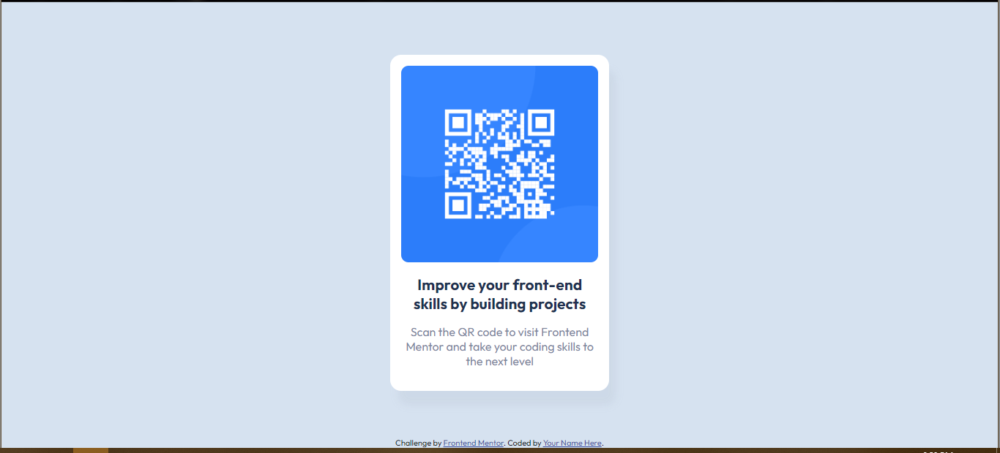
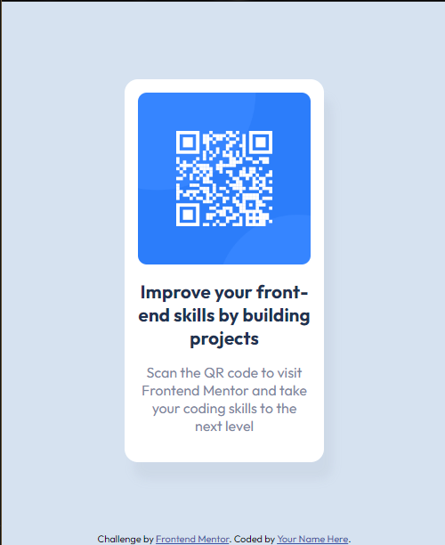

# Frontend Mentor - QR code component solution

This is a solution to the [QR code component challenge on Frontend Mentor](https://www.frontendmentor.io/challenges/qr-code-component-iux_sIO_H). Frontend Mentor challenges help you improve your coding skills by building realistic projects. 

## Table of contents

- [Overview](#overview)
  - [Screenshot](#screenshot)
  - [Links](#links)
- [My process](#my-process)
  - [Built with](#built-with)
  - [Continued development](#continued-development)
  - [Useful resources](#useful-resources)
- [Author](#author)

## Overview

### Screenshot

#### Desktop View

#### Mobile View

### Links

- Solution URL: [Code URL](https://github.com/prajjwalag/QR-code-component)
- Live Site URL: [Live Site URL](https://prajjwalag.github.io/QR-code-component/)

## My process

### Built with

- Semantic HTML5 markup
- CSS custom properties
- Flexbox

### Continued development

1. Make it more responsive.
2. Work on Box-Shadow

### Useful resources

- [CSS Tricks](https://css-tricks.com/snippets/css/a-guide-to-flexbox/) - A very good site to learn flexbox.
- [MDN](https://developer.mozilla.org/en-US/docs/Web/CSS/box-shadow) - Helped in implementing Box Shadow

## Author

- Frontend Mentor - [@prajjwalag](https://www.frontendmentor.io/profile/prajjwalag)

